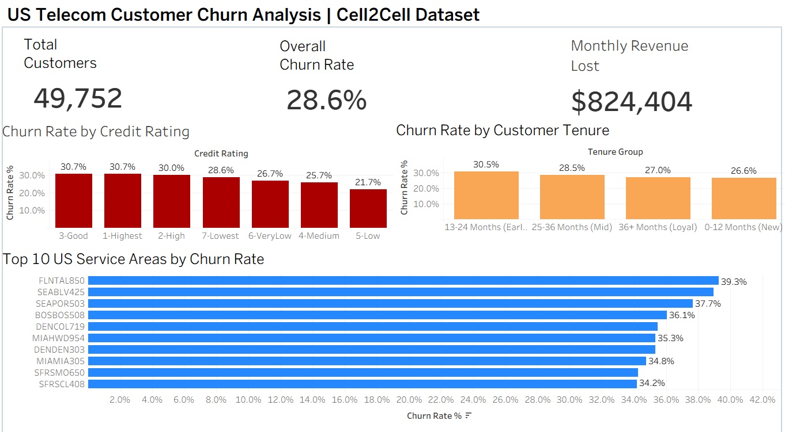

# US Telecom Customer Churn Analysis
**Tools:** Python · MySQL · Tableau  
**Dataset:** Cell2Cell (Real US Telecom Data — 49,752 customers)  
**Dashboard:** [View Live on Tableau Public](https://public.tableau.com/app/profile/saad.ahmed7758/viz/USTelecomCustomerChurnAnalysis/CustomerChurnAnalysis)

---

## Business Problem
A US telecom company is losing nearly 1 in 3 customers. This analysis identifies 
who is churning, when they churn, and where churn is most concentrated — 
to help leadership prioritize retention efforts.

---

## Key Findings
- **$824,404/month** in revenue is lost to churn — 28.2% of total monthly revenue
- **13–24 month customers** churn the most at **30.5%** — the critical retention window
- **High credit customers** (Good/Highest) churn more than low credit ones (30.7% vs 21.7%), 
  suggesting churn is driven by service quality, not financial risk
- **Top churn markets:** Tallahassee FL (39.3%), Seattle WA (38.9%), Portland OR (37.7%)

---

## Dashboard Preview

---

## Project Structure

## Steps Taken
1. **Data Cleaning** — Dropped 1,295 rows with missing values (<2%), 
   converted Churn to binary
2. **EDA in Python** — 5 charts analyzing churn by credit rating, 
   revenue, tenure, and customer care calls
3. **SQL Analysis** — 5 business queries in MySQL answering revenue 
   impact, credit risk, tenure patterns, and geographic concentration
4. **Tableau Dashboard** — 3 KPIs + 3 charts published on Tableau Public
